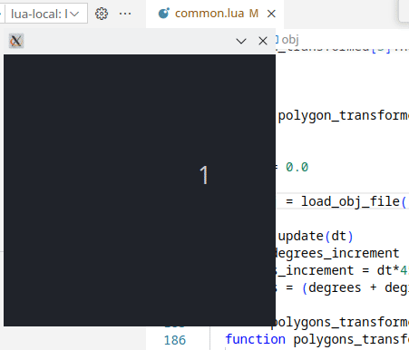
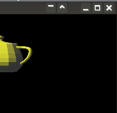

# graphic

A software 3D renderer written in Lua, running on **LuaJIT + SDL3** (primary) or **Love2D** (alternative backend). Implements triangle rasterization, z-buffering, perspective-correct texture mapping, and multi-light shading — entirely in Lua with no native rendering pipeline.

## Screenshots





## Features

- Scanline rasterizer with barycentric coordinate interpolation
- Z-buffer depth testing
- Backface culling
- Perspective-correct UV texture mapping
- Gouraud (per-vertex) and flat shading
- Multi-source diffuse lighting (3 directional lights + ambient)
- OBJ and STL (ASCII) model loading
- BMP texture loading

## Requirements

**LuaJIT + SDL3 (recommended)**
- [LuaJIT](https://luajit.org/) — included in `luajit/` for Windows
- [SDL3](https://libsdl.org/) — `SDL3.dll` included in `luajit/` for Windows; on Linux install `libSDL3`

**Love2D (alternative)**
- [Love2D](https://love2d.org/) 11.x or newer

## Running

**Windows (LuaJIT):**
```cmd
run-app.cmd
```
or directly:
```cmd
luajit\luajit.exe app.lua
```

**Linux (LuaJIT via Wine):**
```bash
bash wine-luajit-app.bash
```

**Linux/macOS (native LuaJIT):**
```bash
luajit app.lua
```

**Love2D (any platform):**
```bash
love .
```

## Project Structure

| File | Description |
|------|-------------|
| `app.lua` | LuaJIT + SDL3 entry point (window, event loop, FFI) |
| `main.lua` | Love2D entry point |
| `common.lua` | Shared rendering: rasterizer, lighting, texture sampling |
| `algebra.lua` | Vector and matrix math (dot, cross, normalize, perspective projection) |
| `loader.lua` | OBJ and STL model loaders |
| `ffi_defs.h` | SDL3 C type definitions for LuaJIT FFI |
| `assets/` | 3D models (OBJ, STL) and textures (BMP) |
| `luajit/` | Bundled LuaJIT + SDL3.dll for Windows |

## Assets

| File | Description |
|------|-------------|
| `assets/head.obj` | Human head mesh |
| `assets/ToughGuy2.obj` | Character model |
| `assets/teapot.obj` | Classic Utah teapot |
| `assets/stl-ascii-teapot-axes.stl` | Teapot in STL format |
| `assets/floor_plane.obj` | Floor plane with UV |
| `assets/axes.obj` | XYZ axis display helper |
| `assets/checker.bmp` | Checkerboard test texture |

## Controls

| Input | Action |
|-------|--------|
| `ESC` / close window | Quit |
| — | Scene rotates automatically at 45°/s |

## Links

- [SDL3](https://libsdl.org/)
- [LuaJIT](https://luajit.org/)
- [Love2D](https://love2d.org/)
- [Renderer techniques documentation](docs/index.html)
